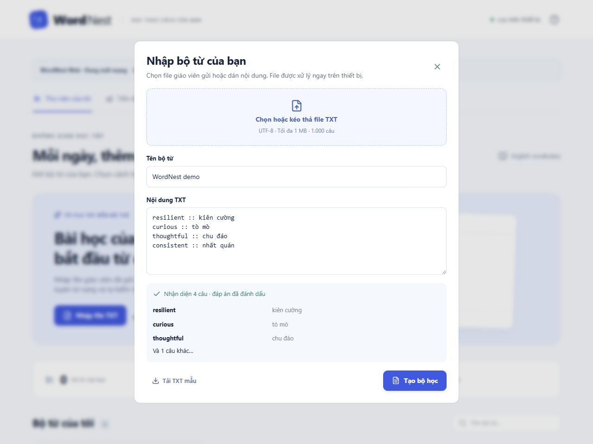
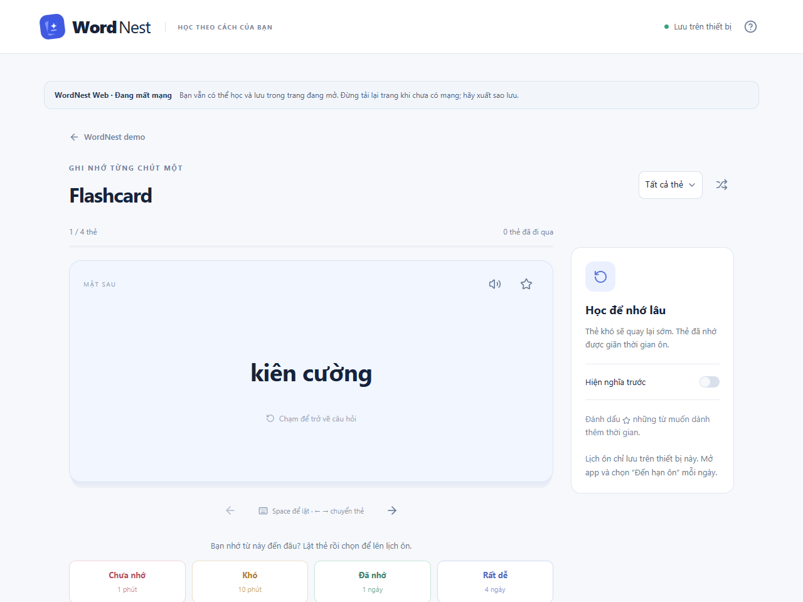
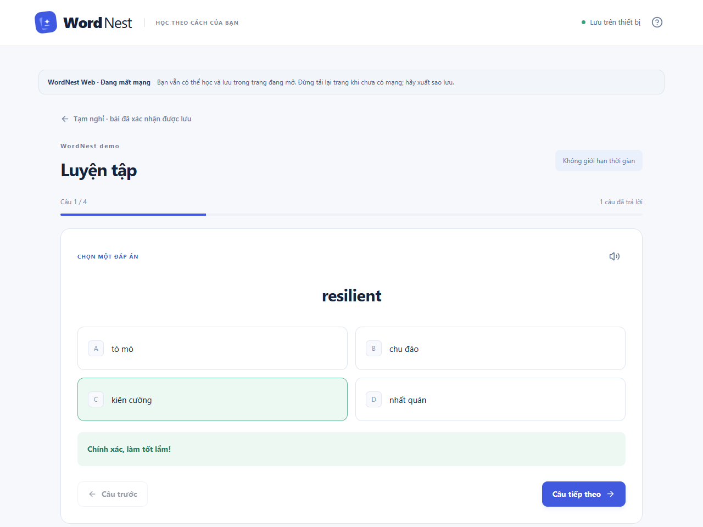
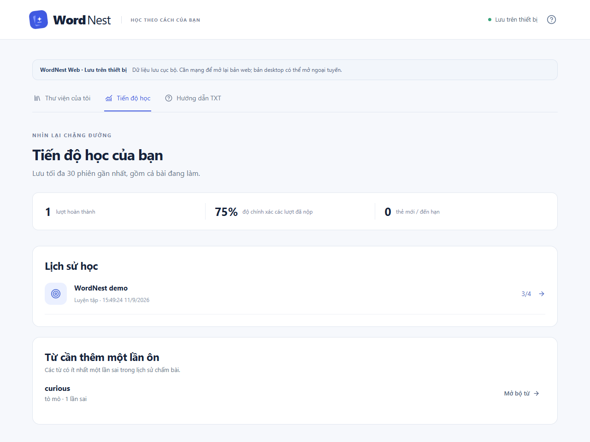
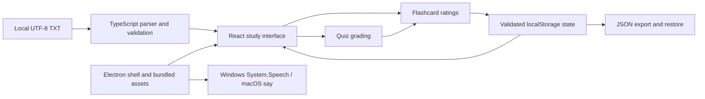

# WordNest

**An offline-first vocabulary study app with an intelligent, deterministic spaced-repetition workflow.** Import a teacher's TXT file, study flashcards, take a quiz, and keep the next review dates on your own device. The interface is in Vietnamese; the primary distributions are Windows and macOS desktop apps.

WordNest is an original product for an English teacher who distributes vocabulary files outside the app. Learners need a simple way to turn those files into practice without creating accounts, uploading their materials, or depending on classroom Wi-Fi. The existing React/Electron app is retained; this focused update connects quiz results to the review scheduler and makes the core workflow demonstrable.

**No generative AI or model provider is used.** “Intelligent” refers to explicit scheduling rules, not an LLM, trained model, or measured prediction of memory. Operating-system text-to-speech and optional browser WebMCP hooks are not AI content-generation features.

## Install the desktop app

**For learners: [download WordNest 0.2.3](https://github.com/dakiemdarktharr/quizziz_clone/releases/tag/v0.2.3)** and install the matching desktop package. Windows users run the `.exe`; macOS users open the `.dmg` and drag WordNest to Applications. No Node.js, terminal, browser or localhost server is needed to use the installed app. Supported targets are Windows 10/11 x64 and macOS Intel/Apple Silicon.

[Hướng dẫn tải, cài đặt và học bằng TXT bằng tiếng Việt](docs/INSTALL.vi.md) · [Release and installer assets](https://github.com/dakiemdarktharr/quizziz_clone/releases/tag/v0.2.3)

## See the workflow

These are actual screenshots of the production web build, captured by the automated demo using [four authored vocabulary pairs](examples/wordnest-demo.txt). The screenshots are not mockups; the displayed 75% is a scripted 3/4 quiz result, not learner research or model accuracy. The same journey is checked separately in Electron.

| Import and validate TXT | Flip and rate a flashcard |
| --- | --- |
|  |  |

| Answer a quiz | Review locally saved progress |
| --- | --- |
|  |  |

[Full quiz result screenshot](docs/demo/04-results.png) · [Demo details and provenance](docs/demo/README.md)

## Architecture



| Boundary | Implementation |
| --- | --- |
| Web entry | `index.html` → `app/main.tsx` → `app/page.tsx`; React, TypeScript, Vite |
| Study rules | `lib/learning.ts`: TXT parsing, quiz generation/scoring, scheduling, idempotent quiz submission |
| Persistence | `lib/storage.ts` validates imported state; `components/use-study-data.ts` commits UI state only after a successful localStorage write |
| UI | Existing flashcard, quiz, writing and matching components; shared controls and error messages |
| Desktop entry | `desktop/main.mjs` serves bundled assets at `wordnest://app/`; sandboxed renderer, context isolation, no renderer Node access |
| Native boundary | A narrow preload bridge opens import UI and requests speech; text travels on stdin as JSON to a fixed Windows script or plain text to macOS say |
| Packaging | `scripts/prepare-desktop.mjs` stages the built UI; Electron Builder produces a Windows NSIS installer and signed macOS DMG/ZIP bundles |

No backend, API key, account, cloud synchronization, or external content service is needed for the desktop study workflow.

## Development setup and run

Prerequisites for development: **Node.js 24**, npm, and Git. Desktop packages target Windows x64 and macOS Intel/Apple Silicon. Install dependencies once with internet access:

```powershell
npm ci
```

Run the web development build:

```powershell
npm run dev
```

Open `http://127.0.0.1:3000/`. For the production web build:

```powershell
npm run build
npm run start -- --port 4173
```

Open `http://127.0.0.1:4173/`. Serve `dist/` over HTTP; do not open its HTML directly with `file://`.

Run the desktop app from source on Windows or macOS:

```powershell
npm run desktop
```

This builds the UI and opens Electron. No development web server is needed by the desktop app.

## Two-minute demo

1. Choose **Nhập file TXT**, select `examples/wordnest-demo.txt`, and choose **Tạo bộ học**. The file contains four English/Vietnamese pairs.
2. Open **Flashcard**, flip `resilient`, then choose **Đã nhớ**. Its first review is scheduled one day later.
3. Return to the deck, turn off **Trộn thứ tự câu hỏi**, and choose **Bắt đầu luyện tập**. Answer `resilient` correctly, intentionally answer `curious` incorrectly, and answer the last two words correctly.
4. Submit the quiz. Expect **3/4**, or **75%**. The already-rated `resilient` moves from a one-day interval to two days; `curious` is scheduled one minute after submission.
5. Open **Tiến độ học**. Reload or reopen the app: the completed quiz and review dates remain. **Xuất sao lưu** exports JSON for moving to another device.

Quiz option positions are shuffled; choose by answer text. Quiz submission applies **Good** to correct answers and **Again** to wrong/unanswered questions, exactly once per completed session. Previously completed sessions are not reprocessed when upgrading.

See [TXT format](docs/TXT-FORMAT.md) for numbered multiple-choice questions, multiple correct answers, and validation limits.

## Offline behavior and error handling

| Environment or failure | Actual behavior |
| --- | --- |
| Installed desktop app | Bundled UI, TXT import, flashcards, quiz, reviews and JSON backup work without internet; renderer network access is blocked |
| Web page already loaded | Can continue studying and saving with the network disabled; a visible status message explains this |
| Reopening/reloading the web app offline | **Not guaranteed. There is no service worker.** Use desktop for offline cold starts |
| Storage quota/access denied | Failed writes leave the previous in-memory and persisted state unchanged; the UI reports that the change was not saved |
| Corrupt saved JSON | Recovery guidance is shown; existing bytes are preserved instead of silently replacing the library |
| Another tab writes data | Further writes are blocked until reload to avoid silently overwriting another tab |
| Invalid TXT/UTF-8 | Import errors are shown before creation; no partial deck is silently committed |
| Speech unavailable | An error is shown; studying continues. Windows uses an installed English voice through PowerShell; macOS uses the installed Samantha voice through say |

Desktop data lives under `%APPDATA%\WordNest`; web data belongs to its browser origin. Transfer between them using JSON export/import. Uninstalling the desktop app preserves the profile. Backups remain the user's responsibility.

## Verify and reproduce evidence

```powershell
npm test
npm run test:security
npm run lint
npm run typecheck
npm run build
```

For the production web journey, keep `npm run start -- --port 4173` running in one terminal, then run in a second terminal:

```powershell
npm run test:journey
```

The default browser is installed Microsoft Edge. To use Playwright Chromium instead:

```powershell
npx playwright install chromium
$env:WORDNEST_BROWSER_CHANNEL = 'chromium'
npm run test:journey
```

Windows packaging and checks:

```powershell
npm run desktop:dist
npm run test:desktop
npm run test:journey -- --desktop
./scripts/installer-smoke.ps1
npm run measure
```

`installer-smoke.ps1` installs into an isolated `outputs/` directory, checks both shortcuts, runs the desktop checks and the complete study journey, then uninstalls the test copy. It refuses to replace an existing WordNest installation. Use the packaged-app checks when WordNest is already installed. Speech testing synthesizes a WAV rather than playing through the speakers.

CI runs logic/security checks, type checking, lint, the production web journey, a Windows installer journey, and Mac DMG/ZIP signature and native workflow checks on separate build/test machines for both architectures. Generated profiles and binaries are ignored by Git. Screenshots/results are stored in `outputs/`; committed evidence is a dated snapshot, not a claim that future runs will have identical timing.

## Measured evidence

Historical **0.2.2** measurements, taken on **2026-09-11**, Windows x64 build 26200, AMD Ryzen AI 5 340, Node.js 24.18.0. Raw measurements, methodology and input hashes: [metrics.json](docs/evidence/metrics.json). Verification details: [acceptance record](docs/ACCEPTANCE.md).

| Measurement | Observed result |
| --- | --- |
| Automated logic/persistence tests | 30 passed; 10 added for this slice |
| Desktop protocol security tests | 2 passed |
| Production web journey | 9 assertion groups passed, including offline study and storage-error cases |
| Electron journey | 7 assertion groups passed, including quiz-to-review scheduling and persisted reload |
| Windows installer | Install, Desktop/Start Menu shortcuts, installed-app checks and uninstall passed locally |
| Parse 1,000 synthetic vocabulary pairs (26,779 UTF-8 bytes) | p50 **0.129 ms**, p95 **0.478 ms** |
| Schedule 1,000 review records | p50 **0.034 ms**, p95 **0.057 ms** |
| Production JavaScript | **445,487 bytes**; gzip **143,128 bytes** |
| Production CSS | **191,192 bytes**; gzip **31,407 bytes** |
| Windows x64 installer | **111,636,932 bytes** (~106.47 MiB) |

Microbenchmarks run in one Node process: five warm-ups, then 25 timed runs; input generation is excluded. They measure pure parser/scheduler functions, not file-picker, disk, UI, startup or full-quiz latency. Gzip sizes use Node's default `gzipSync` settings. The demo fixture and generated benchmark inputs are not a learner dataset. No retention improvement, adoption, model accuracy, or statistically significant educational effect has been measured.

## Release and installation

The source version in this branch is **0.2.3**. Build the verified local Windows installer with:

```powershell
npm ci
npm run desktop:dist
& '.\release\WordNest-Setup-0.2.3-x64.exe'
Get-FileHash '.\release\WordNest-Setup-0.2.3-x64.exe' -Algorithm SHA256
```

Choose an installation directory, then open **WordNest** from Desktop or Start Menu. End users need neither Node.js nor a web browser. Uninstall from **Windows Settings → Apps → WordNest**.

Build a macOS package on the matching Mac architecture (the release workflow builds and tests both architectures on separate machines):

```bash
npm ci
npm run desktop:dist:mac -- --arm64
# On an Intel Mac, use --x64 instead.
```

This produces `.dmg` and `.zip` packages for the selected architecture. A macOS machine is required. `npm run test:mac` verifies signatures and runs the study journey from both packages on that architecture. Release tests download the artifacts onto a new Mac runner before verification.

[GitHub Release v0.2.3](https://github.com/dakiemdarktharr/quizziz_clone/releases/tag/v0.2.3) distributes the tested Windows installer and macOS Intel/Apple Silicon packages, plus the checksum and demo TXT. Choose the platform package; the automatically generated source archives are for development. See the [Vietnamese installation guide](docs/INSTALL.vi.md) for step-by-step instructions.

Windows packages remain unsigned. macOS bundles use an **ad-hoc signature** with hardened runtime and Electron JIT/library entitlements. They are not Apple Developer ID signed or notarized. macOS may still require Privacy & Security → Open Anyway for an unverified developer; this must not be confused with a broken code signature. Do not disable Gatekeeper to work around a damaged-app error. Updates are manual. No Linux or Windows ARM64 package has been verified. Release checksums identify the published artifacts.

## Product and technical decisions

- **Offline desktop first:** teachers already distribute TXT independently; bundling the UI lets learners use that material without accounts or classroom connectivity. The cost is a larger installer and device-local data.
- **Explainable spaced repetition:** short retries for forgotten words and expanding intervals for remembered words make review priorities inspectable. The simple deterministic heuristic is easy to test and does not claim trained or individualized memory prediction.
- **One scheduler for cards and quizzes:** submitted answers feed the same schedule as flashcard ratings. An idempotent completion operation prevents double submission from inflating progress.
- **LocalStorage with validated backups:** retained to avoid a storage rewrite in this focused slice. Writes are atomic at the key level, failures are visible, and JSON supports transfer. Quotas and lack of cross-device sync remain tradeoffs.
- **No AI provider abstraction:** no AI runtime feature exists. Adding a mock LLM interface would imply a capability the product does not have.

## Known limitations

- The scheduler is a small heuristic, not SM-2/FSRS or a validated memory model. Repeated same-day correct quizzes can expand an interval; there is no daily promotion cap. Unanswered submitted questions are treated as incorrect.
- Maximum TXT size is 1,000,000 bytes, with up to 1,000 questions and 200 decks. LocalStorage may fill before those structural limits. Only 30 recent sessions are retained; aggregate counters remain.
- Pair-format quizzes generate distractors from other meanings in the imported deck. Teacher-authored choices are preferable when semantic ambiguity matters.
- No cloud sync, teacher dashboard, classroom multiplayer, background review notifications or automatic app updates.
- Web offline cold starts are unsupported. Native Windows voices can be missing or slow; a previous CI speech run timed out and passed on rerun. Audio generation is tested, not pronunciation quality by human listeners.
- The existing component catalog and Electron runtime are retained, increasing bundle/distribution size. Mobile, screen-reader coverage and other OS versions are not comprehensively verified.
- Historical research in [product references](docs/RESEARCH.vi.md) explains inspiration; WordNest uses its own name, workflow and interface. The legacy GitHub repository slug is retained for existing links.

## Two-line resume bullet

- Developed WordNest, an offline-first vocabulary application using React, TypeScript and Electron, turning teacher-provided TXT files into flashcards and quizzes with local progress and JSON backup.
- Implemented deterministic spaced-repetition updates and idempotent quiz completion; verified the core journey with 36 automated logic/security tests, browser/Electron checks, and Windows/macOS package testing.
